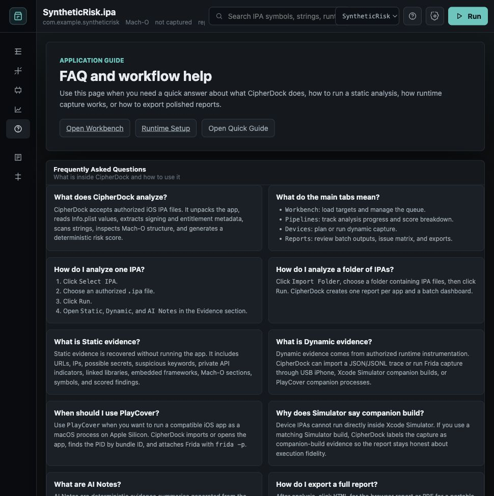
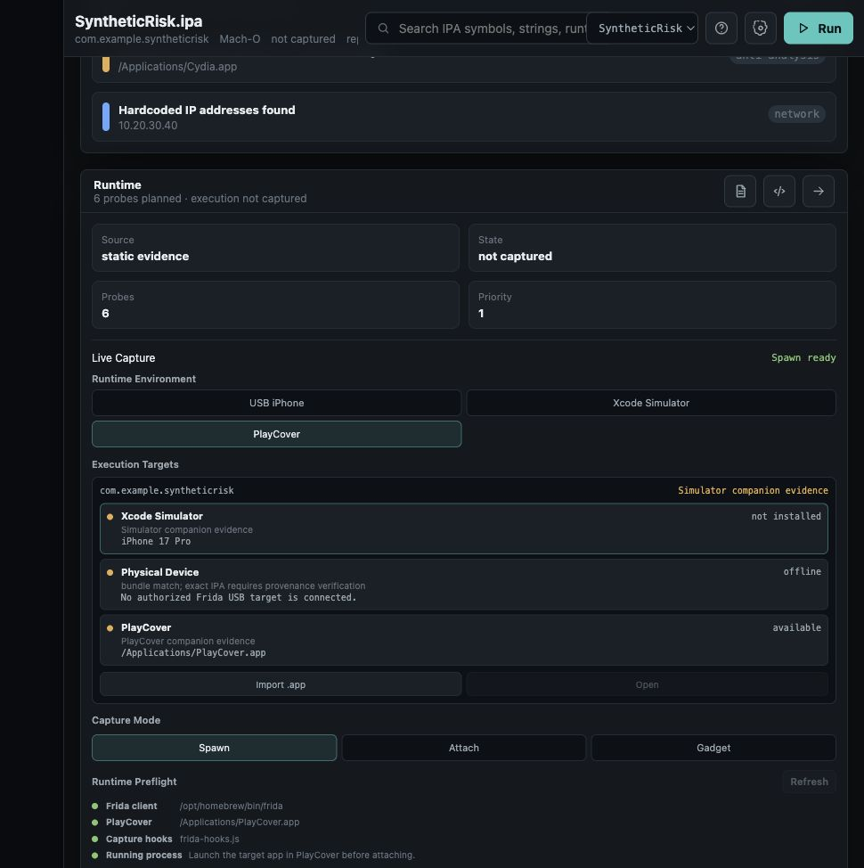

# CipherDock

[](https://doi.org/10.5281/zenodo.20710401)

A jailbreak-free hybrid static-dynamic iOS IPA security assessment framework.

## What It Does

CipherDock accepts authorized iOS IPA files, unpacks them safely, extracts
application metadata and Mach-O evidence, scans strings and symbols, and
produces a deterministic risk score across seven evidence-weighted categories:
transport security, hardcoded secrets, private API usage, jailbreak detection,
network endpoints, entitlements, and symbol intelligence.

It optionally captures live Frida runtime events from an authorized Simulator,
device, or PlayCover companion process and performs cross-layer correlation
between static and dynamic evidence, classifying each captured event as
CONFIRMED, DOMAIN_MATCH, or DYNAMIC_ONLY against static URL evidence.

CipherDock is designed for authorized security research, internal app review,
and reproducible evaluation workflows.

## Workbench Screenshots

Real Mastodon analysis report loaded in the CipherDock Workbench, with
deterministic findings and companion-build Frida capture status.


Static evidence view with recovered Mach-O section data, instruction evidence,
symbol findings, and section visualization.


Dynamic evidence view showing the captured `NSURLSession` endpoint and its
`DOMAIN_MATCH` cross-layer correlation against recovered static URL evidence.


FAQ page built into the workbench, with practical guidance for analysts using
static analysis, dynamic capture, PlayCover, and report exports.



PlayCover runtime mode in the Devices panel. CipherDock can use PlayCover as an
Apple Silicon companion-process backend and attach Frida by PID.



## Requirements

- Python 3.11+
- macOS for complete iOS IPA analysis
- Xcode Command Line Tools
- Apple command-line tools used by the analyzer: `codesign`, `otool`, and `nm`
- Frida 17.9+ for optional dynamic capture
- PlayCover for optional Apple Silicon companion-process capture
- Ghidra `analyzeHeadless` for optional symbol enrichment

Linux can run the pure-Python parsing and report-generation paths, but macOS is
recommended for complete iOS IPA analysis because Apple's binary and signing
tools are macOS-native.

## Installation

```bash
pip install -e .
```

Install optional dynamic workflow helpers when you want runtime capture support
in the same environment:

```bash
pip install -r requirements.txt
```

## macOS DMG Installer

CipherDock includes a DMG installer wizard under `packaging/macos/`. The wizard
installs CipherDock into `/Applications/CipherDock`, creates a managed Python
virtual environment, installs Frida client tools, creates command-line
launchers, and checks PlayCover for Apple Silicon dynamic capture.

Build a standard DMG:

```bash
packaging/macos/build-dmg.sh
```

Build a DMG that also includes a local PlayCover.app:

```bash
INCLUDE_PLAYCOVER=1 packaging/macos/build-dmg.sh
```

If PlayCover is not bundled, the installer detects an existing PlayCover
install, tries Homebrew, or opens the official PlayCover download page.

After installing from the DMG, these commands are available:

```bash
cipherdock --help
cipherdock analyze /path/to/app.ipa --sarif --html --pdf
cipherdock-workbench
cipherdock-workbench-restart
```

`cipherdock-workbench` starts the local browser workbench. Open the printed
local URL in your browser, upload an authorized IPA, and review the generated
static, dynamic, HTML, and PDF report views.

To run a second workbench without stopping the existing listener, choose another
port:

```bash
CIPHERDOCK_PORT=8766 cipherdock-workbench
```

## Quick Start

Analyze a single authorized IPA:

```bash
cipherdock analyze app.ipa --html --pdf --sarif
```

Write reports to a specific output directory:

```bash
cipherdock analyze app.ipa --output reports/app --html --pdf --sarif
```

Launch the local browser workbench:

```bash
cipherdock-workbench
```

Restart the workbench if port 8765 is already in use:

```bash
cipherdock-workbench-restart
```

Run the tool health check:

```bash
cipherdock doctor
```

Run the evaluation pipeline:

```bash
python eval/run_all.py
```

Verify corpus integrity:

```bash
python eval/verify_corpus.py
```

## Sample Output

For each analyzed IPA, CipherDock can generate:

- `report.json` with the complete machine-readable evidence model
- `report.md` with grouped findings and analyst-readable context
- `report.html`, an interactive HTML report for browsing findings, binary
  evidence, dynamic observations, and cross-layer endpoint correlation
- `report.pdf`, a portable executive report with metadata, score breakdown,
  findings, static evidence, dynamic events, tool status, and analyst notes
- `report.sarif` for security tooling ingestion
- `runtime-plan.md` with a capture plan for authorized runtime testing
- `frida-hooks.js` for authorized runtime capture

The browser workbench can also load generated reports and batch reports from
`workbench-data/reports/`.

## Evaluation Results

| Metric | Value |
|--------|-------|
| Corpus | 35 IPAs (5 benign, 30 controlled variants) |
| Held-out F1 | 0.9474 |
| 95% CI | [0.8235, 1.0000] |
| Threshold | 50 (calibration-selected) |
| Significance | p=0.000015 (Mann-Whitney U) |
| Dynamic capture | Frida companion-build, DOMAIN_MATCH |
| Tests passing | 68 |

## Corpus

The evaluation corpus contains 5 real open-source benign iOS applications built
from official source repositories, and 30 controlled synthetic malicious
variants. SHA-256 hashes and build provenance are documented in
`eval/corpus/BUILD.md`.

IPA files are not distributed in this repository. See `eval/corpus/BUILD.md`
for build instructions.

## Project Structure

```text
ire_zero/        Core analysis library
eval/            Corpus evaluation scripts and results
docs/            Technical documentation and screenshots
rules/           JSON detection rule pack
tests/           Test suite
webapp.py        Browser workbench server
```

## License

MIT
