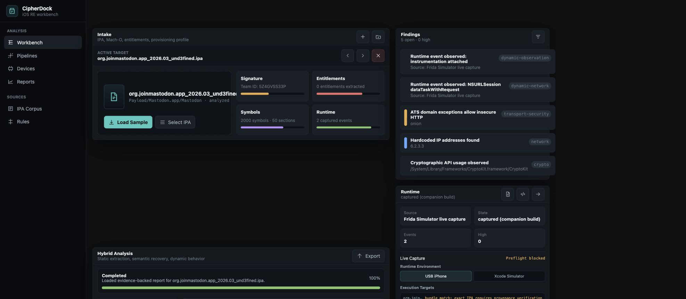
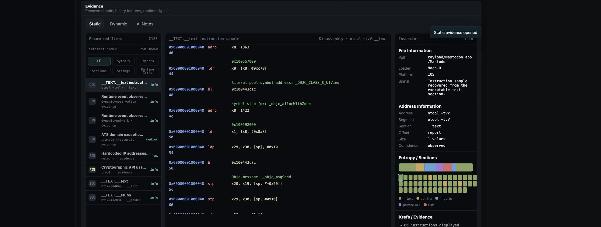
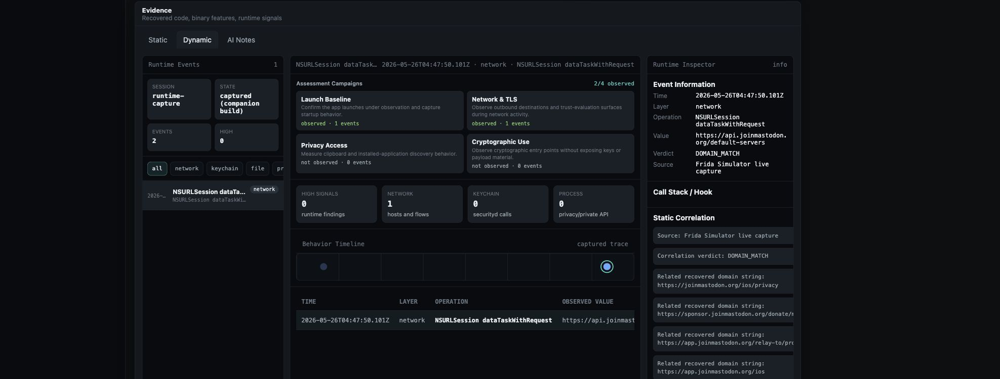

# CipherDock

A jailbreak-free hybrid static-dynamic iOS IPA security assessment framework.

## What It Does

CipherDock accepts authorized iOS IPA files, unpacks them safely, extracts
application metadata and Mach-O evidence, scans strings and symbols, and
produces a deterministic risk score across seven evidence-weighted categories:
transport security, hardcoded secrets, private API usage, jailbreak detection,
network endpoints, entitlements, and symbol intelligence.

It optionally captures live Frida runtime events from an authorized Simulator or
device target and performs cross-layer correlation between static and dynamic
evidence, classifying each captured event as CONFIRMED, DOMAIN_MATCH, or
DYNAMIC_ONLY against static URL evidence.

CipherDock is designed for authorized security research, internal app review,
and reproducible evaluation workflows.

## Workbench Screenshots

Real Mastodon analysis report loaded in the CipherDock Workbench, with
deterministic findings and companion-build Frida capture status.



Static evidence view with recovered Mach-O section data, instruction evidence,
symbol findings, and section visualization.



Dynamic evidence view showing the captured `NSURLSession` endpoint and its
`DOMAIN_MATCH` cross-layer correlation against recovered static URL evidence.



## Requirements

- Python 3.11+
- macOS for complete iOS IPA analysis
- Xcode Command Line Tools
- Apple command-line tools used by the analyzer: `codesign`, `otool`, and `nm`
- Frida 17.9+ for optional dynamic capture
- Objection for optional device-assisted workflows
- Ghidra `analyzeHeadless` for optional symbol enrichment

Linux can run the pure-Python parsing and report-generation paths, but macOS is
recommended for complete iOS IPA analysis because Apple's binary and signing
tools are macOS-native.

## Installation

```bash
pip install -e .
```

Install the optional Frida/Objection workflow helpers when you want dynamic
capture support in the same environment:

```bash
pip install -r requirements.txt
```

## After macOS Installer

For a simpler macOS install, download or open the repository DMG:

```text
dist/CipherDock-1.0.0.dmg
```

Double-click the DMG, then double-click `CipherDock-1.0.0.pkg` to start the
macOS Installer wizard. The installer copies the project to
`/Applications/CipherDock` and creates these commands:

```bash
cipherdock --help
cipherdock analyze /path/to/app.ipa --sarif --html
cipherdock-workbench
```

`cipherdock-workbench` starts the local browser workbench. Open the printed
local URL in your browser, upload an authorized IPA, and review the generated
static, dynamic, and HTML report views.

Workbench data is stored in:

```text
~/Library/Application Support/CipherDock/workbench-data
```

## Quick Start

Analyze one authorized IPA and write JSON, Markdown, SARIF, HTML, and Frida hook
artifacts to a report directory:

```bash
python -m ire_zero analyze app.ipa --sarif --html
```

Write reports to a specific output directory:

```bash
python -m ire_zero analyze app.ipa --output reports/app --sarif --html
```

Launch the local browser workbench:

```bash
python webapp.py
```

Run the tool health check:

```bash
python -m ire_zero doctor
```

Run the evaluation pipeline:

```bash
python eval/run_all.py
```

Verify corpus integrity:

```bash
python eval/verify_corpus.py
```

Generate an evaluation summary from the current evaluation numbers:

```bash
python eval/generate_summary.py
```

## Sample Output

An analysis run with `--sarif --html` produces a report directory containing:

- `report.json` with the complete machine-readable evidence model
- `report.md` with grouped findings and analyst-readable context
- `report.sarif` for security tooling ingestion
- `report.html`, an interactive HTML report for browsing findings, binary
  evidence, dynamic observations, and cross-layer endpoint correlation
- `frida-hooks.js` for authorized runtime capture

The browser workbench can also load generated reports and batch reports from
`workbench-data/reports/`.

## Evaluation Results

| Metric | Value |
|--------|-------|
| Corpus | 35 IPAs (5 benign, 30 controlled variants) |
| Held-out F1 | 0.9474 |
| 95% CI | [0.8235, 1.0000] |
| Threshold | 50 (calibration-selected) |
| Significance | p=0.000015 (Mann-Whitney U) |
| Dynamic capture | Frida companion-build, DOMAIN_MATCH |
| Tests passing | 58 |

## Corpus

The evaluation corpus contains 5 real open-source benign iOS applications built
from official source repositories, and 30 controlled synthetic malicious
variants. SHA-256 hashes and build provenance are documented in
`eval/corpus/BUILD.md`.

IPA files are not distributed in this repository. See `eval/corpus/BUILD.md`
for build instructions.

## Project Structure

```text
ire_zero/        Core analysis library
eval/            Corpus evaluation scripts and results
docs/            Evaluation documentation
rules/           JSON detection rule pack
tests/           Test suite
webapp.py        Browser workbench server
```

## License

MIT
